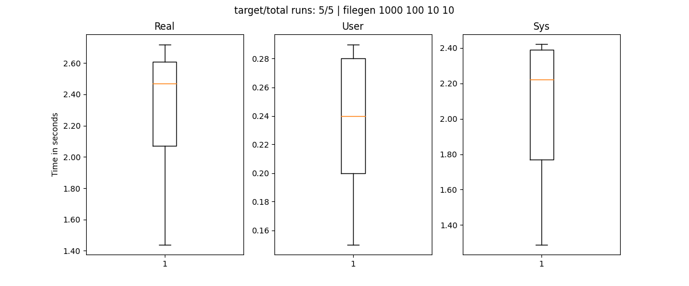

# Perfomance Oriented Computing - 02 - Beiser Tobias
## A) External CPU load
The `loadgen` program generates CPU load based on a loaded profile. The more loadgen processes we spawn with `exec_with_workstation_heavy.sh` the more CPU usage we get and therefore increase the runtime of all programs. This also means, that the measurements increase in randomness.  

To counteract this "instability" I improved my benchmark script to calculate a 95% confidence interval from the first n-1 measurements, and increase the number of runs until the n'th measurement falls within the calculated interval.

To run a program with the increase workload simply run this command in your terminal and adjust the paths accordingly:
~~~bash
cd tools/load_generator
./exec_with_workstation_heavy.sh "python3 ../../exercises/sheet02/benchmark.py -o benchmark_mmul.json ../../small_samples/build/mmul"
~~~

### mmul
#### no load:
PC: 

LCC3:

#### with load
PC: 

LCC3:

## B External I/O load
### Working principle of io_loadgen
`io_loadgen` is mainly inspired by filegen but it also adds some more I/O features such as reading filecontents and removing files from the FS. It also runs forever or until cancelled/killed manually.  
The program operates as follows:
1. Create a global working directory for the process
2. Create a subdirectory
3. Fill that subdirectory with n files of m size (can be configured via args)
4. Read the files if configured
5. Delete the files if configured
6. Delete the subdirectory
7. Repeat Step 2-6 until cancelled or killed

To build the program simply execute these commands:
~~~bash
mkdir build && cd build
cmake .. -G Ninja -DCMAKE_BUILD_TYPE=Releaes && ninja
~~~

We can scale the workload by either enabling/disabling reading/removing files, increasing filesize or files per directory.
To further increase the workload it is also possible to start multiple instances of this program via `exec_with_io_load.sh` and pass the program we want to benchmark as argument (e.g. `"python3 ../benchmark.py ../../../small_samples/build/filegen 1000 100 10 10"`)

For my experiments I tested the filegen program without io_loadgen, with a single instance and with 5 instances of io_loadgen
### Without io_loadgen

PC:

### Single instance io_loadgen

PC:

### Five instances io_loadgen

PC:

### LCC3
Sadly I was unable to test filegen on the LCC3 cluster as it randomly segfaulted (depending on which cluster the job was assigned to) when generating too many files. For reference: I used 100(dirs) 100(files) 10(min size) 10(max size) as parameters. I also set /tmp as workdir for the job with the --chdir flag and upon further inspection, it seems that the storage on the nodes seems to be full.  
Also when executing the program with the stated parameters, the runs that went through took about 80s. For comparison, the same parameters on my local system took about 0.2s