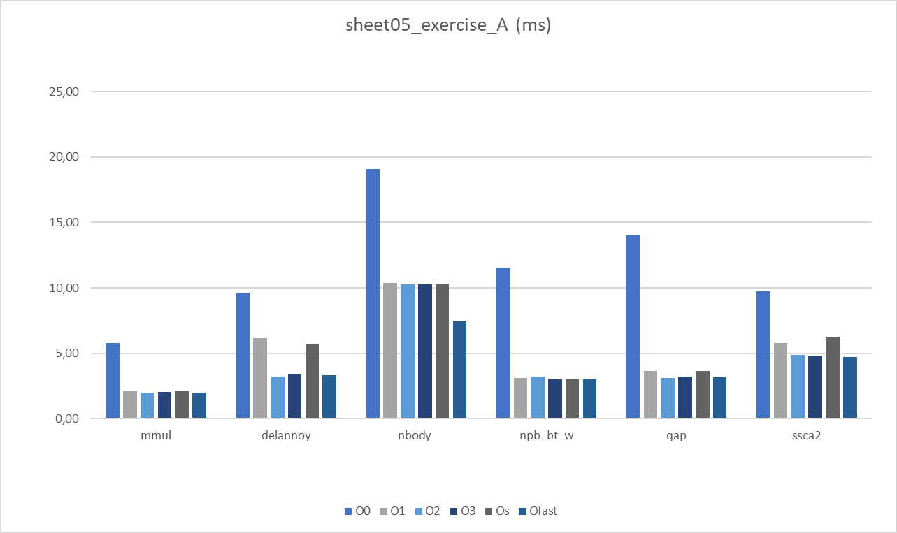

# Perfomance Oriented Computing - 05 - Beiser Tobias
## A) Basic Optimization Levels

## B) Individual Compiler Optimizations

To determine the set of compiler flags that change we can use the diff command in linux and compare the outputs of the two `gcc -Q --help=optimizers -O2/O3` commmands like this:
`diff <(gcc -Q --help=optimizers -O2) <(gcc -Q --help=optimizers -O3)`

We then get the following differences:

| Optimization            | -O2                                      | -O3                                     |
|-------------------------|------------------------------------------|-----------------------------------------|
| -fgcse-after-reload     | [disabled]                               | [enabled]                               |
| -fipa-cp-clone          | [disabled]                               | [enabled]                               |
| -floop-interchange      | [disabled]                               | [enabled]                               |
| -floop-unroll-and-jam   | [disabled]                               | [enabled]                               |
| -fpeel-loops            | [disabled]                               | [enabled]                               |
| -fpredictive-commoning  | [disabled]                               | [enabled]                               |
| -fsplit-loops           | [disabled]                               | [enabled]                               |
| -fsplit-paths           | [disabled]                               | [enabled]                               |
| -ftree-loop-distribution| [disabled]                               | [enabled]                               |
| -ftree-partial-pre      | [disabled]                               | [enabled]                               |
| -funroll-completely-grow-size | [disabled]                          | [enabled]                               |
| -funswitch-loops        | [disabled]                               | [enabled]                               |
| -fvect-cost-model       | [very-cheap]                             | [dynamic]                               |
| -fversion-loops-for-strides | [disabled]                            | [enabled]                               |

Performance results:

|                  | mmul  | nbody | qap   | delannoy | npb_bt_w | ssca2 |
|------------------|-------|-------|-------|----------|----------|-------|
| -fgcse-after-reload           | 2,01  | 10,26 | 3,11  | 3,27     | 3,22     | 4,94  |
| -fipa-cp-clone         | 2,0   | 10,29 | 3,11  | 3,23     | 3,22     | 4,83  |
| -floop-interchange       | 1,99  | 10,26 | 3,12  | 3,22     | 3,22     | 4,94  |
| -floop-unroll-and-jam       | 1,99  | 10,22 | 3,12  | 3,23     | 3,21     | 4,82  |
| -fpeel-loops       | 2,01  | 10,24 | 3,12  | 3,23     | 3,1      | 4,84  |
| -fpredictive-commoning   | 2,0   | 10,23 | 3,12  | 3,24     | 3,23     | 4,9   |
| -fsplit-loops       | 1,99  | 10,27 | 3,11  | 3,23     | 3,22     | 4,91  |
| -fsplit-paths       | 1,99  | 10,23 | 3,12  | 3,22     | 3,22     | 4,92  |
| -ftree-loop-distribution    | 2,16  | 10,22 | 3,11  | 3,22     | 3,24     | 4,95  |
| -ftree-partial-pre      | 2,01  | 10,22 | 3,12  | 3,36     | 3,21     | 4,83  |
| -funswitch-loops       | 2,01  | 10,22 | 3,18  | 3,22     | 3,21     | 4,84  |
| -fvect-cost-model=dynamic      | 2,13  | 10,25 | 3,12  | 3,22     | 3,2      | 4,99  |
| -fversion-loops-for-strides   | 1,98  | 10,22 | 3,19  | 3,23     | 3,23     | 4,92  |

