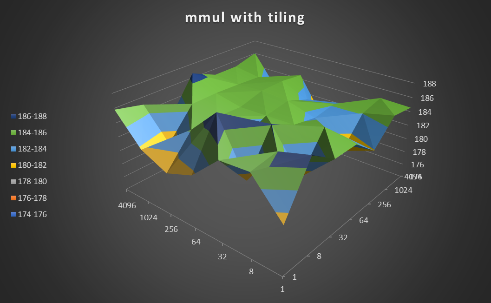
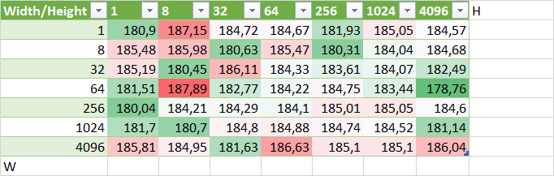

# Perfomance Oriented Computing - 05 - Beiser Tobias
## A) Basic Optimization Levels
The tile optimization was applied to the two outer loops

~~~C
for (int i = 0; i < N; i += TILE_HEIGHT) {
    for (int j = 0; j < K; j += TILE_WIDTH) {
        for (int ii = i; ii < (i + TILE_HEIGHT < N ? i + TILE_HEIGHT : N); ii++) {
            for (int jj = j; jj < (j + TILE_WIDTH < K ? j + TILE_WIDTH : K); jj++) {
                TYPE sum = 0;
                for (int k = 0; k < M; k++) {
                    sum += A[ii][k] * B[k][jj];
                }
                C[ii][jj] = sum;
            }
        }
    }
}
~~~

## B) Cache Latency Benchmark

Based on this [Article](https://www.nexthink.com/blog/smarter-cpu-testing-kaby-lake-haswell-memory) and [GitRepo](https://github.com/berestovskyy/applied-benchmarks/tree/master/memory-latency)

- Create a linked list
- To avoid optimization we need to add padding to each node, such that each node fills up the whole cache line
- Number of nodes = mem_block_size / CacheLineSize
- Connect last node with first node to make a cyclic graph
- We then just traverse the list and measure the time
