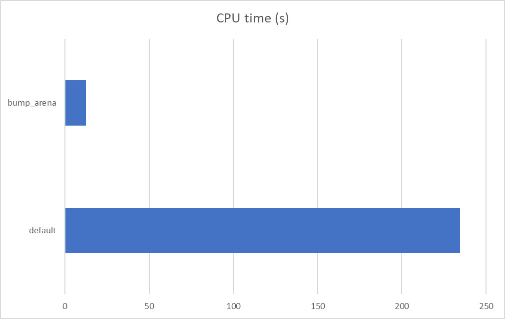

# Perfomance Oriented Computing - 07 - Beiser Tobias

## A) Preloading General Allocators

Preloading can be done by setting the LD_PRELOAD environment variable to the shared library object of the allocator to use:  
```#SBATCH --export=LD_PRELOAD=/home/cb76/cb761223/sheet07/rpmalloc/build/ninja/linux/release/x86-64/rpmalloc-cccf0ca/librpmalloc.so```


### No preloading

~~~bash 
Command being timed: "ninja"
User time (seconds): 480.91
System time (seconds): 10.65
Percent of CPU this job got: 669%
Elapsed (wall clock) time (h:mm:ss or m:ss): 1:13.43
Maximum resident set size (kbytes): 588488
~~~

### mimalloc

~~~bash
Command being timed: "ninja"
User time (seconds): 453.29
System time (seconds): 8.18
Percent of CPU this job got: 665%
Elapsed (wall clock) time (h:mm:ss or m:ss): 1:09.38
Maximum resident set size (kbytes): 729776
~~~

### rpmalloc

~~~bash
Command being timed: "ninja"
User time (seconds): 457.11
System time (seconds): 8.23
Percent of CPU this job got: 645%
Elapsed (wall clock) time (h:mm:ss or m:ss): 1:12.12
Maximum resident set size (kbytes): 743896
~~~


## B) Implementing a special-purpose allocator

Since a bulk arena allocator works different than a regular allocator we can't just create a shared library and change swap it out in our benchmark program with LD_PRELOAD. Instead I copied the original malloctest and implemented the arena allocator directly in the source code of the benchmark.

We first initialize our arena with size = upper limit of the benchmark * iterations, so we have enough memory for a single repetetion. After each repetition we can "free" the arena by resetting the pointer.

After the benchmark we free the whole arena object again.


### default allocator

~~~bash
Command being timed: "./malloctest 1 500 1000000 10 1000"
User time (seconds): 99.66
System time (seconds): 134.83
Percent of CPU this job got: 99%
Elapsed (wall clock) time (h:mm:ss or m:ss): 3:55.31
Maximum resident set size (kbytes): 517196
~~~


### bump allocator

~~~bash
Command being timed: "./malloctest_arena 1 500 1000000 10 1000"
User time (seconds): 12.34
System time (seconds): 0.00
Percent of CPU this job got: 99%
Elapsed (wall clock) time (h:mm:ss or m:ss): 0:12.40
Maximum resident set size (kbytes): 9116
~~~




