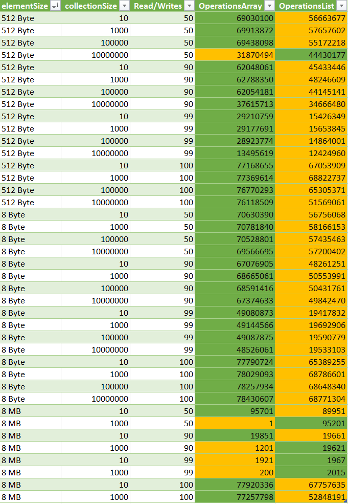
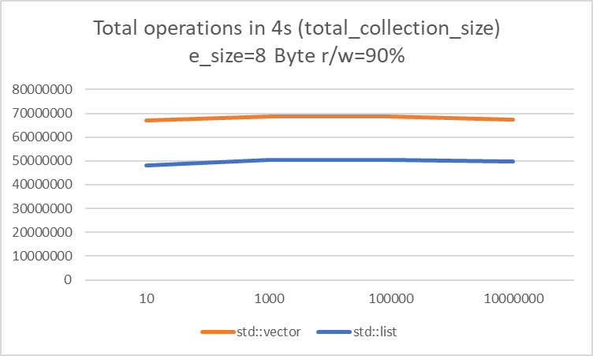
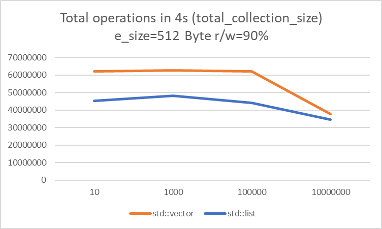
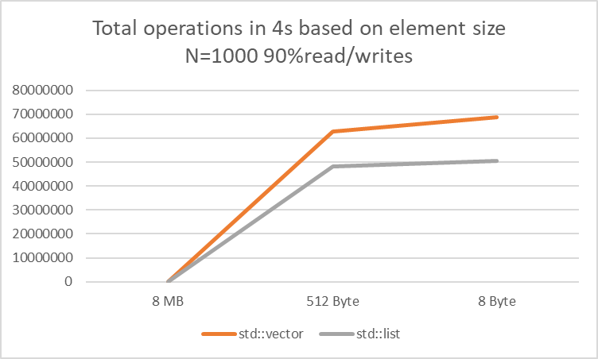
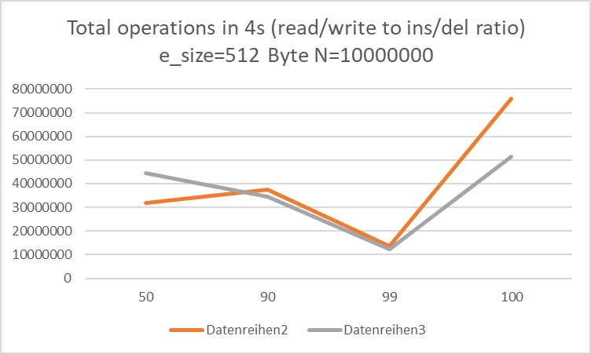
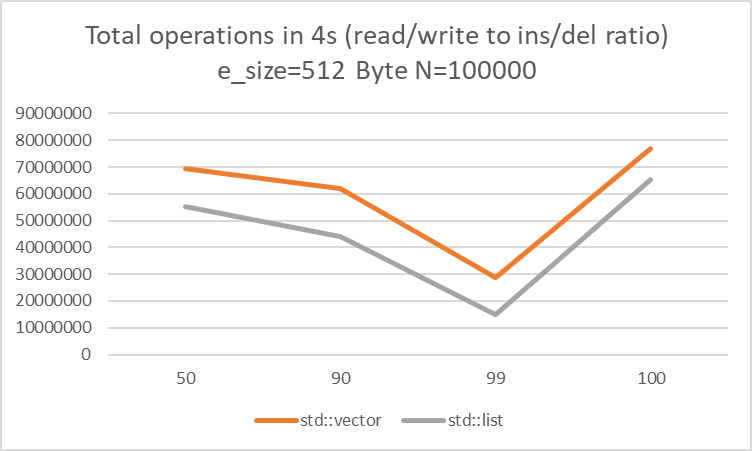

# Perfomance Oriented Computing - 09 - Beiser Tobias

The benchmark tool can be built with
~~~bash
mkdir build && cd build
cmake .. -G Ninja -DCMAKE_BUILD_TYPE=Releaes && ninja
~~~

For Benchmarking, each combination of parameters was executed in a single job. Each job tested array and list performance over 4 seconds, after which the benchmark was stopped and the total operations counted.  
Problems occured while benchmarking the 8MB element size with N>1000 as the systems could not allocate enough memory.  

When looking at the benchmarks, it seems as if the std::vector outperforms the std::list implementations. However as the element size grows, the list starts to outperform std::vector.

